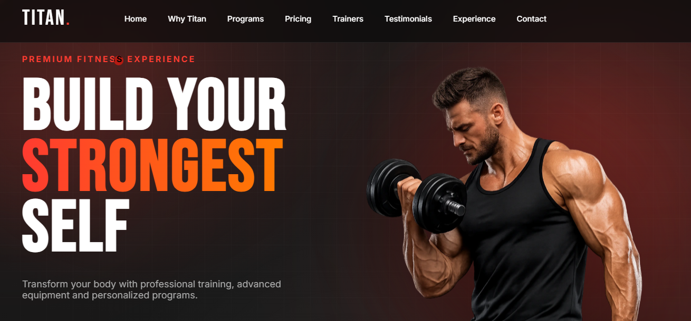
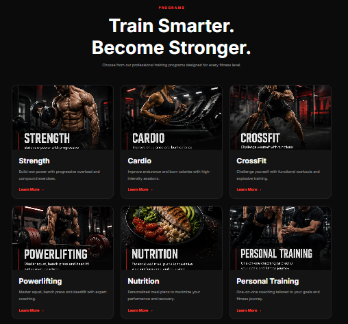
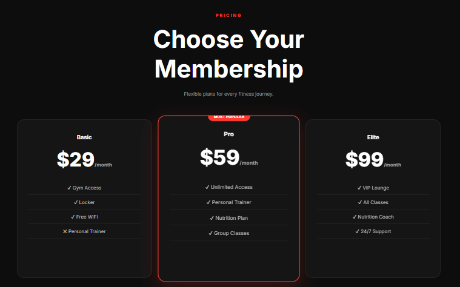
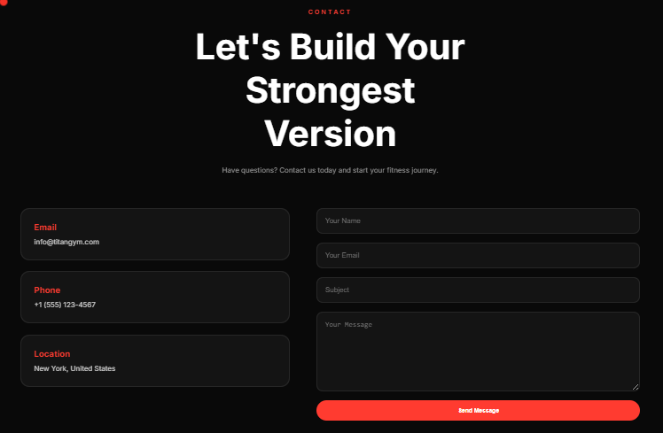

# 💪 TITAN GYM

A modern, responsive gym landing page built with **HTML, CSS, JavaScript, Vite, and GSAP**. Designed with a premium aesthetic, smooth animations, and an engaging user experience.



---

## 🚀 Live Demo

🔗 https://localbtstudio-tech.github.io/TITAN-GYM/

---

## 📸 Preview

| Hero | Programs |
|------|----------|
|  |  |

| Pricing | Contact |
|---------|---------|
|  |  |

---

## ✨ Features

- 🎨 Modern premium UI
- 📱 Fully responsive design
- ⚡ Smooth scrolling experience
- 🎬 GSAP-powered animations
- 🏋️ Interactive training program modals
- 💰 Pricing section
- 👨‍🏫 Trainers showcase
- ⭐ Testimonials slider
- 📩 Contact form (mailto)
- 🌙 Dark theme design
- 🎯 Interactive UI effects
- 🖱️ Custom cursor and spotlight effects
---

## 🛠 Tech Stack

### Frontend
- HTML5
- CSS3 (Modular CSS Architecture)
- JavaScript (ES6+)

### Build Tool
- Vite

### Libraries & Animation
- GSAP (Advanced Animations)
- Swiper.js (Responsive Sliders)
- Lenis Smooth Scroll (Smooth Scrolling)
- Lucide Icons (UI Icons)

### Data Visualization
- Chart.js (Prepared for Future Dashboard & Analytics)

### Deployment
- GitHub Pages
- gh-pages

---

## 📂 Project Structure

```
TITAN-GYM/
│
├── public/
│   └── images/
│
├── src/
│   ├── assets/
│   ├── components/
│   ├── css/
│   ├── js/
│   ├── main.js
│   └── style.css
│
├── index.html
├── package.json
├── vite.config.js
└── README.md
```

---

## ⚙️ Installation

Clone the repository

```bash
git clone https://github.com/localbtstudio-tech/titan-gym.git
```

Navigate to the project

```bash
cd titan-gym
```

Install dependencies

```bash
npm install
```

Start the development server

```bash
npm run dev
```

Build for production

```bash
npm run build
```

---

## 🎯 Goals

This project was created to demonstrate:

- Responsive web development
- Modern UI/UX design
- JavaScript interactions
- Component-based project organization
- Clean and maintainable code

---

## 📈 Future Improvements

- Backend integration
- Membership dashboard
- Online booking system
- Nutrition tracking

---

## 👨‍💻 Author

**Hamza Weslati**  
Founder & Web Developer at **LocalBoost Studio**

🌐 GitHub  
https://github.com/localbtstudio-tech

💼 LinkedIn  
https://www.linkedin.com/in/hamza-weslati-9a99a8419

📧 Email  
localbtstudio@gmail.com

---

## ⭐ Support

If you enjoyed this project, consider giving it a **⭐ Star** on GitHub.

It helps support my work and motivates me to build more high-quality projects.
